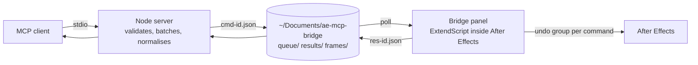

# aftereffects-mcp

A Model Context Protocol server that lets Claude Code, Claude Desktop, VS Code and any other MCP client build and edit inside a running Adobe After Effects, plus four standalone builder panels for people who prefer a button. It is for motion designers who want an agent to do the tedious parts (comps, layers, keyframes, effects, markers, renders) and for developers automating After Effects.

What sets it apart from other After Effects servers:

- Batching: many tool calls in one round-trip and one undo step (`batch`, `set-keyframes-multi`, `apply-effects-bulk`).
- Self-verification: `see-frame` and `see-frames` return PNG frames so the agent looks at its own work before reporting.
- Rig tools: the four studio rigs (edge glow, power warp transition, depth map blur reveal, blur colour reveal) as one-call tools with every parameter.
- A style file: pin house durations, easings, text styles and colours, and reference them as `@style.entrance` or `@style.h1`.
- An agent guide served by `get-help`, plus MCP prompts and resources, so an agent with 190 tools uses them well.
- Idempotent effects, real text animators, one easing model for every keyframe, and every command undoable in one step.


`docs/media/demo.gif` is a placeholder. To record one: open After Effects and the bridge panel side by side with Claude Code, ask for the title card from `examples/01-title-card.md`, capture the screen with any recorder, trim to 20 to 30 seconds, and export as GIF (or MP4 and link it here).

## Quick start

### Mac

1. Install Node.js 18 or later from https://nodejs.org and Claude Code with `npm install -g @anthropic-ai/claude-code`.
2. `git clone https://github.com/irfanabdulhameed/aftereffects-mcp.git && cd aftereffects-mcp`
3. `./setup/setup-mac.sh` (installs dependencies, builds, copies the panel into After Effects, registers the server with Claude Code)
4. In After Effects: Settings > Scripting & Expressions, tick "Allow Scripts to Write Files and Access Network", restart, then Window > mcp-bridge-auto.jsx.
5. In Claude Code: "ping After Effects". If it answers, ask for something real.

### Windows

1. Install Node.js 18 or later and Claude Code as above.
2. `git clone https://github.com/irfanabdulhameed/aftereffects-mcp.git; cd aftereffects-mcp`
3. `.\setup\setup-windows.ps1` in PowerShell.
4. In After Effects: Edit > Preferences > Scripting & Expressions, tick "Allow Scripts to Write Files and Access Network", restart, then Window > mcp-bridge-auto.jsx.
5. In Claude Code: "ping After Effects".

Manual registration for any MCP client:

```bash
claude mcp add AfterEffectsMCP node /absolute/path/to/aftereffects-mcp/server/build/index.js
```

Full details, manual steps and environment variables: [setup/README.md](setup/README.md).

## What you can ask for

- "Make a 1080p comp called Intro and add a title that fades in."
- "Add a lower third for Maya Chen, Head of Product, sliding in at 1 s and out at 5 s."
- "Put markers on the beats of the music layer and pulse the logo on every downbeat."
- "Give every selected layer a staggered fade and slide-up entrance."
- "Apply a soft shadow and a subtle vignette to the card, then show me frame 40."
- "Build the edge glow rig behind the logo in pink and purple."
- "Type on this headline at 15 characters per second with a typewriter animator."
- "Loop this clip with time remapping and add a wiggle to the camera."
- "Find every broken expression in the project and list them."
- "Read the timing from the reference comp and rebuild the lower third in our style file."

## Tool overview

| Group | Count | What is in it |
|---|---|---|
| Project | 16 | open, save, new, import, replace footage, folders, cleanup |
| Composition | 12 | create with presets, settings, work area, precompose, crop |
| Layers | 29 | list, details, create every layer type, duplicate, order, parent, flags, mattes, timing, align, sequence |
| Transform and properties | 7 | get and set any property, transform, anchor point, fit, bounds |
| Keyframes | 14 | bulk and multi writes, easing, move, copy, reverse, bake, stagger |
| Expressions | 8 | set, errors, 21 presets, expression controls |
| Text | 13 | style, fonts, 12 text animator presets, selectors, outlines, boxes |
| Shapes | 9 | create, add, fill, stroke, path, modifiers, trim paths, repeater |
| Masks | 7 | create, edit, keyframe, from shape, reveal animation |
| Effects and presets | 19 | apply (idempotent), bulk, inspect, set, keyframe, copy, 33 templates, .ffx presets |
| Camera, lights, 3D | 6 | camera settings, camera moves, lights, materials, look at |
| Time | 7 | time remap, freeze, speed, reverse, blending, loop |
| Markers and audio | 10 | markers, waveform analysis, audio to keyframes, beat grids |
| Render and preview | 10 | see-frame, contact sheets, render queue, aerender, stills |
| Rigs | 5 | the four panels as tools |
| Batch, workflow, utilities | 17 | batch, undo, status, snapshots, find, replace, relink |

Every tool with its inputs and an example: [docs/TOOLS.md](docs/TOOLS.md) (generated). How an agent should work with them: [docs/AGENT-GUIDE.md](docs/AGENT-GUIDE.md).

## The four builder panels

Each panel is a dockable ScriptUI panel in [panels/](panels/) with its own guide, and each also exists as a `rig-*` tool with the same logic and defaults. See [panels/README.md](panels/README.md).

**Edge Glow** ([guide](panels/edge-glow/GUIDE.md)). A rounded rectangle with a glowing four-colour gradient rim, an animated light sweep and a soft coloured halo. Tool: `rig-edge-glow`.


**Power Warp Transition** ([guide](panels/power-warp-transition/GUIDE.md)). A depth-map driven transition: gradient wipe, glowing scan line, pseudo-3D shake, CC Glass warp, chromatic aberration and fine distortions, keyframed to a time window. Tool: `rig-power-warp-transition`.


**Depth Map Blur Reveal** ([guide](panels/depth-map-blur-reveal/GUIDE.md)). An image resolves out of a depth-weighted blur with an exposure lift and a fading glow. Tool: `rig-depth-map-blur-reveal`.


**Blur Color Reveal** ([guide](panels/blur-color-reveal/GUIDE.md)). A soft two-tone colour disc blooms outward to reveal the content beneath. Tool: `rig-blur-color-reveal`.


The still images are placeholders; render one frame of each rig with `see-frame` or `export-frame-png` and save it under `docs/media/`.

## Architecture in one diagram



Commands are files with ids; the panel executes them in order inside one undo group each; results come back as files matched on the id. Details, timing, environment variables and the reasons behind the design: [docs/ARCHITECTURE.md](docs/ARCHITECTURE.md).

## Style file

Point `AE_MCP_STYLE_FILE` at a JSON or YAML file with named durations, easings, stagger values, text styles, colours and free-text rules. The agent sees a summary in `get-help` and can write `"@style.entrance"` or `"@style.h1"` wherever an easing or text style is accepted. See [docs/style-file.example.json](docs/style-file.example.json).

## Troubleshooting

1. The panel is not in the Window menu: `npm run install-bridge`, then quit and reopen After Effects.
2. Every tool times out: tick "Allow Scripts to Write Files and Access Network" in Scripting & Expressions and reopen the panel.
3. `bridge-not-running`: the panel is closed or Auto-run is unticked. Nothing ran; call the tool again once the panel is open.
4. `timeout` on a render or big batch: it is still running; `get-results` with the id fetches it when done.
5. `versionsMatch: false` from `get-bridge-status`: `npm run build && npm run install-bridge`, reopen the panel.

Every error code and what to do: [docs/TROUBLESHOOTING.md](docs/TROUBLESHOOTING.md).

## Compatibility

- After Effects: written against the 2024 to 2026 scripting API. The file bridge, undo groups and every core tool work on 2022 and later. Features that need newer versions return a clear `unsupported` error on older ones: per-layer track mattes (23.0), the font list (24.0), `saveFrameToPng` for `see-frame` (22.3, with a render-queue fallback), dropdown control items (2023), saving presets by script.
- Tested here: the Node side, the mock bridge and the assembled panel parse on macOS with Node 20 to 23. The ExtendScript side could not be run against a live After Effects during this rewrite; the smoke test (`npm run smoke`) exists for exactly that, and `docs/DECISIONS.md` lists the matchNames and version behaviours that are unverified.
- Mac and Windows: paths, the panel install and the setup scripts handle both. Continuous integration runs on Ubuntu and Windows with Node 20 and 22.
- Node.js 18 or later.

## Contributing

How to add a tool, the ES3 rules and the shared API: [docs/CONTRIBUTING.md](docs/CONTRIBUTING.md). Judgement calls made during the rewrite: [docs/DECISIONS.md](docs/DECISIONS.md). Release notes: [CHANGELOG.md](CHANGELOG.md).

## Credits

- The server started as a fork of [TheLlamainator/after-effects-mcp](https://github.com/TheLlamainator/after-effects-mcp), which built on [Dakkshin/after-effects-mcp](https://github.com/Dakkshin/after-effects-mcp). Both are MIT licensed; the license file is kept.
- The Edge Glow and Power Warp Transition panels recreate looks from public After Effects tutorials (the Power Warp technique by VideoLancer) by frame analysis; the Depth Map Blur Reveal and Blur Color Reveal panels recreate reference reels.
- Libraries: `@modelcontextprotocol/sdk`, `zod`, `pngjs`, `acorn`, `vitest`, `typescript`.

## License

MIT. See [LICENSE](LICENSE).
