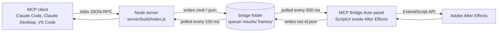
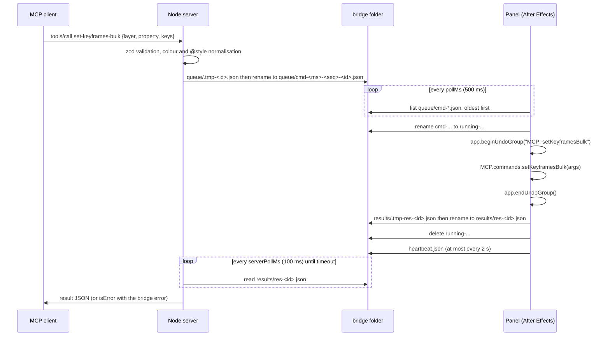

# Architecture

## The parts



- The Node server speaks the Model Context Protocol over stdio. It validates every tool call with zod, normalises colours and style references, and turns the call into one bridge command.
- The bridge folder (`~/Documents/ae-mcp-bridge`, or `AE_MCP_BRIDGE_DIR`) is the only channel between the server and After Effects. It works on Mac and Windows, needs no sockets or native modules, and survives either side restarting.
- The panel is a single ExtendScript file assembled at build time from `server/src/scripts`. It polls the queue with `app.scheduleTask`, executes commands, and writes results.

## Why files

After Effects scripting cannot open a socket or run a server, and the only way to execute script inside a running After Effects is from inside After Effects. A ScriptUI panel that polls a folder is the smallest thing that works on every version since CS6, on both platforms, without administrator rights beyond the one-time panel install. The cost is latency: each command waits for the next poll. The design compensates with `batch` and the `*-bulk` tools, which do many things in one round-trip.

## One command, end to end



### Command file

```json
{
  "id": "lq3k9x1a2b",
  "command": "setKeyframesBulk",
  "args": { "layer": { "name": "Title" }, "property": "Transform/Opacity", "keys": [] },
  "createdAt": "2026-09-14T10:00:00.000Z",
  "status": "pending",
  "protocol": 2
}
```

The file name `cmd-<createdAt ms, 13 digits>-<sequence, 4 digits>-<id>.json` sorts oldest first, so the panel processes commands in the order they were sent even when several arrive in the same millisecond.

### Result file

```json
{
  "id": "lq3k9x1a2b",
  "command": "setKeyframesBulk",
  "status": "ok",
  "result": { "composition": {}, "layer": {}, "property": {}, "keyframesWritten": 2 },
  "startedAt": "2026-09-14T10:00:00.400Z",
  "finishedAt": "2026-09-14T10:00:00.460Z",
  "durationMs": 60,
  "aeVersion": "24.6.0x1",
  "bridgeVersion": "2.0.0"
}
```

On failure `status` is `"error"` and `error` holds `{ message, code, command, id, line, fileName, details }`. `line` and `fileName` come from the ExtendScript error; `details` carries structured hints such as the list of available compositions.

### Identifiers, not names

The server matches results on `id` alone. Two consecutive calls to the same command get two ids and two result files. There is no modification-time heuristic anywhere.

### Atomic handoff

Both sides write a temporary file and rename it into place, so a half-written file is never read. The panel renames a command file to `running-` before executing it. If After Effects crashes mid-command, the file is still there when the panel next starts; the panel then writes an `interrupted` error result for it and removes it, so a mutating command never runs twice by accident.

### Timeouts

| Situation | What the server does |
|---|---|
| Result arrives within the timeout | Returns it |
| Timeout and the command file is still `cmd-` (never picked up) | Deletes the file and returns `bridge-not-running`, with a hint based on the heartbeat age |
| Timeout and the file is `running-` (the panel has it) | Returns `timeout` with the id; the command keeps running; `get-results` fetches it later |

Normal commands wait `AE_MCP_TIMEOUT_MS` (15 s). Render, batch, rig and export tools wait `AE_MCP_RENDER_TIMEOUT_MS` (10 min).

### Undo

The panel wraps every command in `app.beginUndoGroup("MCP: <command>")` and `app.endUndoGroup()` in a `try/finally`. `batch` is one command, so a whole batch is one undo step. Commands that call other commands go through `MCP.invoke`, which does not open a nested group.

### Heartbeat and options

`heartbeat.json` is written by the panel at most every two seconds with the After Effects version, panel version, protocol, poll interval, queue length, counters and the last command. `get-bridge-status` reads it without waiting on After Effects. `bridge-options.json` holds `pollMs` and `verbosity`; the server seeds it from the environment on start, `set-bridge-options` changes it, and the panel re-reads it every five seconds.

### Cleanup

On start the server removes result files, temp files and frame PNGs older than `AE_MCP_RESULT_MAX_AGE_MS` (one hour).

## Inside the panel

```
server/src/scripts/
  lib/polyfills.jsx   ES3 polyfills (indexOf, map, forEach, Object.keys, trim, ...)
  lib/json.jsx        JSON.parse and JSON.stringify for ExtendScript
  lib/core.jsx        the MCP namespace: register, invoke, fail, arguments, time, atomic file writes
  lib/color.jsx       colour conversion
  lib/undo.jsx        withUndo, undo, redo
  lib/resolve.jsx     resolveComp, resolveLayer, resolveProperty, resolveEffect, resolveItem, findProp, pathOf
  lib/serialize.jsx   the summaries every command returns
  lib/easing.jsx      easing presets, segment application, spatial tangents, bezier approximation
  commands/*.jsx      one file per tool group, each MCP.register("name", fn, meta)
  commands/rigs/*.jsx the four builder rigs
  panel/mcp-bridge-auto.jsx  UI and the polling loop
```

`server/scripts/build-bridge.js` concatenates these in a fixed order into `server/build/scripts/mcp-bridge-auto.jsx`, with a banner per source file so an ExtendScript line number can be traced back. `npm run install-bridge` copies that file into the After Effects ScriptUI Panels folder.

The dispatcher is a lookup in `MCP.commands`, not a switch. Registering a command is the whole job; nothing else lists it. On the Node side `defineTool` derives the command name from the tool name (kebab-case to camelCase), and a unit test asserts every bridge-backed tool has a registered command.

## Inside the server

```
server/src/
  index.ts            creates the McpServer, registers groups, starts stdio
  bridge/paths.ts     bridge folder layout and environment configuration
  bridge/client.ts    enqueue, waitForResult, run, heartbeat, options, cleanup
  bridge/types.ts     command, result, heartbeat and error shapes; BridgeError
  schemas/common.ts   CompRef, LayerRef, PropertyPath, Easing, Color, TimeArgs, enums
  schemas/color.ts    colour normalisation
  schemas/style.ts    style file loader and @style resolution
  tools/registry.ts   defineTool, the catalog, batch argument preparation
  tools/all.ts        registers every group
  tools/*.ts          one file per group
  tools/help.ts       get-help, resources, prompts
  render/             PNG helpers for see-frame and see-frames
```

`defineTool` gives every tool the same behaviour: validate, resolve `@style.*`, send one command, return JSON text, and turn a `BridgeError` into an `isError` result with `{tool, error, message, command, id, details, bridgeError}`.

## Easing model

An easing value on a keyframe describes the segment that arrives at it: the out handle of the previous key and the in handle of the key. Presets map to `KeyframeEase(speed, influence)` pairs (see `lib/easing.jsx` for the table). Cubic-bezier is approximated per segment: influence from the x coordinates, speed from the handle slopes times the segment's value change per second. Spatial keyframes get zero tangents by default so motion paths are straight; `spatial: "auto"` keeps auto-bezier.

## Environment variables

| Variable | Default | Meaning |
|---|---|---|
| `AE_MCP_BRIDGE_DIR` | `~/Documents/ae-mcp-bridge` | Folder shared between the server and the panel. The panel always uses `~/Documents/ae-mcp-bridge`; change both if you change this. |
| `AE_MCP_TIMEOUT_MS` | `15000` | Wait for normal commands |
| `AE_MCP_RENDER_TIMEOUT_MS` | `600000` | Wait for render, batch, rig and export commands |
| `AE_MCP_SERVER_POLL_MS` | `100` | How often the server checks for a result file |
| `AE_MCP_BRIDGE_POLL_MS` | `500` | Seeds `bridge-options.json` pollMs for the panel |
| `AE_MCP_BRIDGE_VERBOSITY` | `1` | Seeds the panel log level: 0 quiet, 1 normal, 2 debug |
| `AE_MCP_RESULT_MAX_AGE_MS` | `3600000` | Results older than this are removed on server start |
| `AE_MCP_ALLOW_RAW_SCRIPT` | unset | `1` enables `run-extendscript` |
| `AE_MCP_STYLE_FILE` | unset | Path to a JSON or YAML style file |

## Build and install

```
npm install            root workspace; installs server dependencies
npm run build          tsc to server/build, then assemble the panel
npm run lint           ES3 parse of every .jsx source and the assembled panel
npm test               vitest against the mock bridge
npm run gen-docs       writes docs/TOOLS.md from the registered tools
npm run install-bridge copies the assembled panel into After Effects
npm run smoke          checklist plus a live test against After Effects
```

The MCP entry point is `server/build/index.js`.
